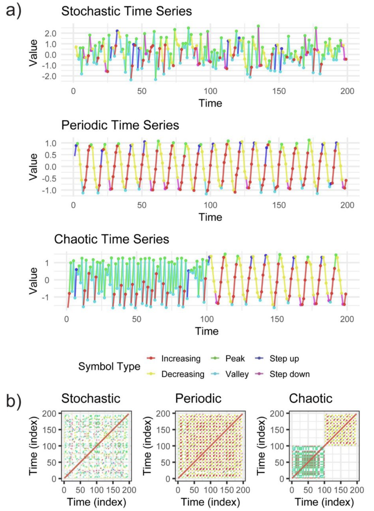

# OneDrive Batch Video Processor
Hybrid Bash + Python pipeline for processing OneDrive-hosted videos with batching and cloud file handling.

I did my best to generalize it for public viewing, but many parts are hardcoded for our specific use case. For example the band we are most interested in is hardcoded in terms of the horn reference sound matching.

# Background
This project came out of a real workflow problem. A teammate a while back had built scaffolding for an automated video cutting pipeline which used direct cross-correlation between the reference horn waveform and each video’s extracted audio. 
The goal was to crop it and keep the 10 seconds before the horn sound played and the 120 seconds after (using librosa).

I refactored the pipeline in various ways including orchestrating a bash-side to scale processing of videos hosted on OneDrive. I also engineered horn specific features, added a sliding window comparison component, and then trained a logistic regression using the same windows in the properly extracted videos compared to the improperly extracted videos to improve detection even further.

Before my method 194 out of 407 processed videos failed meaning a fail rate of about 47.6% of videos.

After incorporating sRQA and FFT/harmonic features, 33 out of 407 processed videos failed, bringing the fail rate down to approximately 8.1%. Eventually, this was dropped as other work took over, and we didn't have that many more videos to cut once the fail rate was already low enough but, it was a very interesting feature engineering sidequest for me personally!

# Feature Engineering and Model Incorporation

## The original “better features” (FFT band + harmonics)
The core idea was to move away from raw waveform comparison and instead compare the *frequency content* of each 1-second candidate window. The horn had a distinct frequency profile, so I inspected a spectrogram and identified a focused “band of interest” that captured the signal well: 640–3400 Hz.

The reference template was a 1-second horn clip from a public SFX database. In theory, this template could be replaced with another target sound, as long as the relevant frequency band and envelope are re-estimated.

The features:
- `peak_match` — dot product between the horn-template FFT bins and candidate-window FFT bins at the selected 1x, 2x, and 3x harmonic indices.
- `peak_energy` — total candidate-window energy at those selected 1x, 2x, and 3x harmonic indices.
- `raw_score` — the score used without a model: `peak_match * concentration`, rewarding windows that both match the horn template and concentrate energy in the expected harmonic bins (more on this below).

When theres no model:

- A sliding window approach is used where starting from the 0th second, and in .5s hops, overlapping windows are scaned and `raw_score` is calculated.
- The video with the best raw score is how our video cutting point is decided on.

## Model Training

Once I had a set of videos I knew for sure had been succesfully cut or not succesfully cut, what I realized I was able to do next was label each with either a 0 (fail) or a 1 (pass) meaning I essentially had a labeled dataset.

So, taking a step back I thought, well if we are already calculating theese two features lets add two more:

- `total_band_energy` — total candidate-window energy across the full 640–3400 Hz band.
- `concentration` — proportion of band energy concentrated in the selected harmonic indices: `peak_energy / total_band_energy`.

And one of our PIs had recently submitted software on [sRQA](https://doi.org/10.64898/2026.03.31.715624), that motivated me to try sRQA-style features on the horn-detection problem:

Thus the full set of feature I extracted from all videos became:
`["peak_match","peak_energy","total_band_energy","concentration","RR","DET","L","Lmax","DIV","ENTR","LAM","TT","Vmax","VENTR","MRT","RTE","NMPRT","TREND"]`

Model file paths to pay attention to:
- `batch_vid_processing.sh` points `MODEL` at: `models/event_logistic_model.joblib`
- `vid_processing_modules/model_training.py` saves to: `feature_sets/horn_logistic_model_v2.joblib`

So if you’re training with `model_training.py` and then running the batch crop pipeline, either:
- move/rename the trained joblib into `models/event_logistic_model.joblib`, **or**
- update `MODEL=...` in `batch_vid_processing.sh` to point at `feature_sets/horn_logistic_model_v2.joblib`

## Model training 

What it does:
- reads: `feature_sets/horn_training_features_master.csv`
- uses the same 18 features: `"peak_match","peak_energy","total_band_energy","concentration","RR","DET","L","Lmax","DIV","ENTR","LAM","TT","Vmax","VENTR","MRT","RTE","NMPRT","TREND"`
- `train_test_split(..., test_size=0.2, random_state=42, stratify=y)`
- pipeline: `StandardScaler()` + `LogisticRegression(class_weight="balanced", max_iter=1000)`
- converts probabilities to a class label using a hard threshold: `pred = (prob > 0.3).astype(int)`
    - The 0.3 threshold is used in the training/evaluation script to classify test windows, but the main detection code uses model probabilities as scores and selects the highest-scoring window.
- prints confusion matrix + classification report
- saves error slices for manual review:
  - `feature_sets/false_negatives.csv`
  - `feature_sets/false_positives.csv`
- saves the trained model:
  - `feature_sets/horn_logistic_model_v2.joblib`

Note: `batch_feature_extraction.sh` writes to `feature_sets/event_training_features_master.csv` by default, but `model_training.py` reads `feature_sets/horn_training_features_master.csv`. Either rename the file, or change `csv_path` in `model_training.py` (or change `TRAINING_CSV` in the bash script) so they match.

# Batch processing

If you’ve ever worked with OneDrive in a production setting, you already know the main issue: files aren’t always actually local. Between cloud-only states, inconsistent syncing, and large file sizes, just “looping over files” stops being reliable pretty quickly.

My solution was to build a pipeline that treats OneDrive like a semi-remote storage layer and processes files locally in controlled batches.

The workflow looks like this:

1. Force files to download locally (`attrib -U`)
2. Copy them into a local working directory (scratch space)
3. Process them in batches using the existing Python script
4. Move results back to OneDrive
5. Clean up local files to avoid storage issues
6. Log any failures for later inspection

The pipeline uses:
- Bash for orchestration, batching, and file/system operations
- Python for the actual signal-based video processing

This split keeps the system simple while still handling a pretty messy environment.

## The two “main” entrypoints
Look in:
- `batch_vid_processing.sh` (cropping pipeline)
- `batch_feature_extraction.sh` (feature extraction pipeline)

### 1) Batch video detection + crop (and push outputs back)
`batch_vid_processing.sh` does:
- collects videos with `find "$SRC" -type f -iname "*.mp4"`
- batches with `get_next_batch` (from `pipeline_utils.sh`)
- hydrates + copies each file into `local_batch/` via `local_download` (uses `attrib -U` + `wait_for_stable_file` + `cp` retries)
- runs the python entrypoint: `python vid_processing_modules/video_event_detection.py "$BATCH" "$REF" "$MODEL"`
- copies outputs from `$BATCH/cropped_videos/` into `$DEST_PROCESSED/` via `move_and_wait_outputs`
- unpins outputs and input files (`attrib +U`)
- logs anything missing via `identify_unprocessed_files` into `logs/failed_files.txt`
- cleans up `local_batch/` (mp4 + horn_audios + cropped_videos + csv)

Important:
- `attrib -U/+U` is Windows-specific. This is meant to be run in something like Git Bash on Windows / a Windows environment where those commands exist.

### 2) Batch feature extraction (append to a master CSV)
`batch_feature_extraction.sh` does:
- batches over `input_videos/`
- hydrates + copies to `local_batch/`
- runs: `python vid_processing_modules/feature_matrix_extraction.py "$BATCH" "$REF" "$TRAINING_CSV"`
- appends into `feature_sets/event_training_features_master.csv`

# Motivation
The goal here wasn’t just to “get it working,” but to make the workflow reliable when dealing with:

- cloud-backed file systems
- large datasets
- limited local storage

I also wanted to show how shell scripting can still be useful for system-level orchestration alongside Python.

# Notes

- The included Python script is a simplified version of the original. 

- In theory there would be a virtual environment inside of `venv/` that would activate the proper python package installations needed to run modules such as librosa etc. (the bash scripts assume `source venv/Scripts/activate`)

- `ffmpeg` is required because cropping is done via a direct ffmpeg call (see `crop_video()` in `vid_detection_utils.py`).

- The file `failed_files.txt`, and the directory `local_batch/` are meant to simulate the kind of output you would get when running the pipeline.

*DISCLAIMER*: I am not an audio expert. These features were based on methods I found were common practice and worked for my purpose. I am sure there are better alternatives.